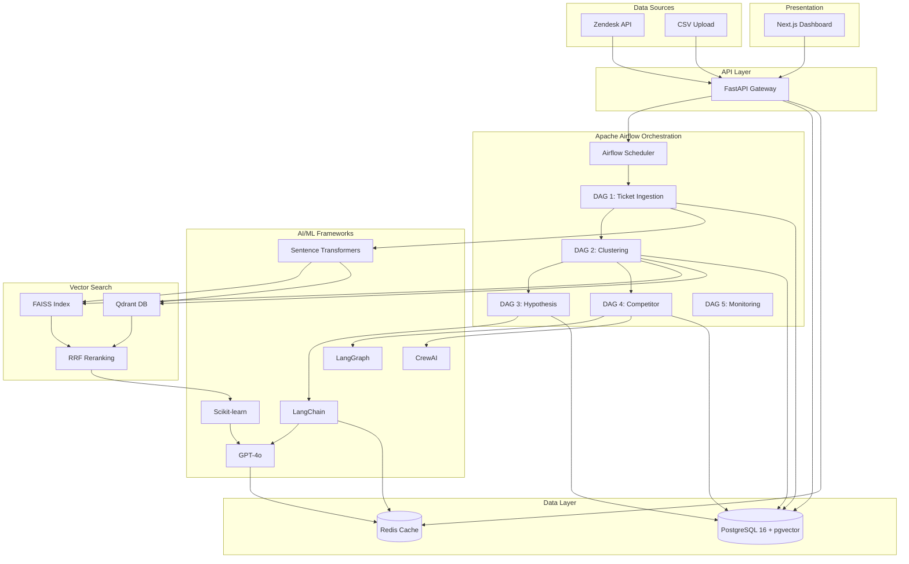

# Echolab AI Platform - Architecture Diagram

## 🎨 For Eraser.io - Professional Architecture Diagram

Copy and paste the code below into **[Eraser.io](https://app.eraser.io/)** to generate the architecture diagram.

---

## Eraser.io Code

```eraser
title Echolab AI Platform - Production Architecture

// ==========================================
// DATA SOURCES LAYER
// ==========================================
Zendesk API [icon: database, color: blue]
CSV Upload [icon: file, color: green]

// ==========================================
// INGESTION & API LAYER
// ==========================================
FastAPI Gateway [icon: server, color: orange] {
  REST API
  Async psycopg2
  Pydantic Validation
}

// ==========================================
// ORCHESTRATION LAYER - APACHE AIRFLOW
// ==========================================
Airflow Scheduler [icon: calendar, color: red] {
  CeleryExecutor
  Flower Monitoring
  Task Queue Management
}

// DAG Components
DAG 1: Ticket Ingestion [icon: workflow, color: purple] {
  - Fetch Tickets (Zendesk/CSV)
  - Data Validation
  - Generate Embeddings
  - Store Vectors
}

DAG 2: Pain Point Clustering [icon: workflow, color: purple] {
  - Retrieve Embeddings
  - Hybrid Vector Search
  - RRF Reranking
  - KMeans + DBSCAN Clustering
  - GPT-4o Cluster Labeling
}

DAG 3: Hypothesis Generation [icon: workflow, color: purple] {
  - Analyze Pain Points
  - GPT-4o Hypothesis Creation
  - Confidence Scoring
  - A/B Test Planning
}

DAG 4: Competitor Analysis [icon: workflow, color: purple] {
  - CrewAI Multi-Agent
  - Research Agent
  - Analysis Agent
  - Report Generation
}

DAG 5: System Monitoring [icon: workflow, color: purple] {
  - Pipeline Health Checks
  - Performance Metrics
  - Alert Management
}

// ==========================================
// AI/ML FRAMEWORKS LAYER
// ==========================================
LangChain Framework [icon: brain, color: teal] {
  LLM Orchestration
  Chain Management
  Memory Systems
}

LangGraph Engine [icon: brain, color: teal] {
  Multi-Agent Workflows
  State Management
  Graph-based Execution
}

CrewAI Agents [icon: brain, color: teal] {
  Autonomous Agents
  Task Delegation
  Collaborative AI
}

OpenAI GPT-4o [icon: ai, color: cyan] {
  Clustering Labels
  Hypothesis Generation
  Semantic Analysis
}

Sentence Transformers [icon: ai, color: cyan] {
  all-MiniLM-L6-v2
  Embedding Generation
  384-dimensional vectors
}

Scikit-learn [icon: chart, color: yellow] {
  KMeans Clustering
  DBSCAN
  Cosine Similarity
}

// ==========================================
// VECTOR SEARCH LAYER
// ==========================================
FAISS Index [icon: search, color: pink] {
  Fast Approximate Search
  Dense Vector Indexing
  Millisecond Retrieval
}

Qdrant Vector DB [icon: database, color: pink] {
  HNSW Indexing
  Exact Similarity Search
  Production-Ready
}

RRF Reranking [icon: filter, color: pink] {
  Reciprocal Rank Fusion
  Hybrid Results Merger
  Precision Optimization
}

// ==========================================
// DATA LAYER
// ==========================================
PostgreSQL 16 [icon: database, color: navy] {
  pgvector Extension
  Relational + Vector Data
  JSONB Support
  Full-text Search
}

Redis Cache [icon: database, color: red] {
  LLM Response Cache
  Rate Limiting
  Circuit Breaker
  LRU Eviction
}

// ==========================================
// FRONTEND (Minimal for AI Focus)
// ==========================================
Next.js Dashboard [icon: monitor, color: gray] {
  React 19
  TailwindCSS
  Real-time UI
}

// ==========================================
// EXTERNAL SERVICES
// ==========================================
OpenAI API [icon: cloud, color: green]
Hugging Face Hub [icon: cloud, color: yellow]

// ==========================================
// CONNECTIONS & DATA FLOW
// ==========================================

// Data Sources → API Gateway
Zendesk API > FastAPI Gateway
CSV Upload > FastAPI Gateway

// API Gateway → Airflow
FastAPI Gateway > Airflow Scheduler

// Airflow → DAGs (Sequential Execution)
Airflow Scheduler > DAG 1: Ticket Ingestion
DAG 1: Ticket Ingestion > DAG 2: Pain Point Clustering
DAG 2: Pain Point Clustering > DAG 3: Hypothesis Generation
DAG 2: Pain Point Clustering > DAG 4: Competitor Analysis
Airflow Scheduler > DAG 5: System Monitoring

// DAG 1 → AI/ML Frameworks
DAG 1: Ticket Ingestion > Sentence Transformers
Sentence Transformers > FAISS Index
Sentence Transformers > Qdrant Vector DB

// DAG 2 → Vector Search + AI
DAG 2: Pain Point Clustering > FAISS Index
DAG 2: Pain Point Clustering > Qdrant Vector DB
FAISS Index > RRF Reranking
Qdrant Vector DB > RRF Reranking
RRF Reranking > Scikit-learn
Scikit-learn > OpenAI GPT-4o
OpenAI GPT-4o > PostgreSQL 16

// DAG 3 → AI Frameworks
DAG 3: Hypothesis Generation > LangChain Framework
LangChain Framework > OpenAI GPT-4o

// DAG 4 → Multi-Agent AI
DAG 4: Competitor Analysis > CrewAI Agents
DAG 4: Competitor Analysis > LangGraph Engine
CrewAI Agents > OpenAI API
LangGraph Engine > OpenAI API

// AI Services
LangChain Framework > OpenAI API
Sentence Transformers > Hugging Face Hub

// Data Storage
DAG 1: Ticket Ingestion > PostgreSQL 16
DAG 2: Pain Point Clustering > PostgreSQL 16
DAG 3: Hypothesis Generation > PostgreSQL 16
DAG 4: Competitor Analysis > PostgreSQL 16

// Caching Layer
OpenAI GPT-4o > Redis Cache
LangChain Framework > Redis Cache
FastAPI Gateway > Redis Cache

// Frontend Access
Next.js Dashboard > FastAPI Gateway
FastAPI Gateway > PostgreSQL 16
FastAPI Gateway > Redis Cache

// Monitoring
DAG 5: System Monitoring > PostgreSQL 16
DAG 5: System Monitoring > Redis Cache
DAG 5: System Monitoring > Airflow Scheduler
```

---

## 📋 How to Use This Diagram

### Option 1: Eraser.io (Recommended)
1. Go to **[app.eraser.io](https://app.eraser.io/)**
2. Create a new diagram
3. Click on "Diagram as Code" mode
4. Paste the code above
5. The diagram will auto-generate with professional styling
6. Export as PNG/SVG for presentations

### Option 2: Alternative Tools
If Eraser.io doesn't work, use these alternatives:

#### **Excalidraw** (Free, Simple)
- URL: https://excalidraw.com/
- Manual drawing required but very clean
- Export as PNG/SVG

#### **Draw.io / Diagrams.net** (Free, Professional)
- URL: https://app.diagrams.net/
- Use AWS/GCP icons library
- Great for architecture diagrams

#### **Mermaid.js** (Code-based)


---

## 🎯 Key Architecture Highlights for Interview

### 1. **Data Ingestion Pipeline**
- Multi-source support (Zendesk API + CSV)
- Automated data validation and cleaning
- Real-time and batch processing capabilities

### 2. **Orchestration Layer (Apache Airflow)**
- **5 Production DAGs** with dependencies
- CeleryExecutor for distributed task execution
- Flower for real-time monitoring
- Task retry logic and error handling

### 3. **AI/ML Stack (Core of the System)**
- **LangChain**: LLM orchestration and chain management
- **LangGraph**: Multi-agent workflow engine
- **CrewAI**: Autonomous agent framework for competitor analysis
- **GPT-4o**: Semantic understanding, clustering labels, hypothesis generation
- **Sentence Transformers**: 384-dim embeddings for semantic search
- **Scikit-learn**: KMeans + DBSCAN for pain point clustering

### 4. **Hybrid Vector Search Architecture**
- **FAISS**: Fast approximate similarity search (milliseconds)
- **Qdrant**: Production vector database with HNSW indexing
- **RRF Reranking**: Reciprocal Rank Fusion for precision
- **Why Hybrid?**: Combines FAISS speed + Qdrant accuracy

### 5. **Data Layer**
- **PostgreSQL 16** with pgvector extension (relational + vector)
- **Redis**: 3-layer caching (LLM responses, rate limiting, circuit breaker)
- Normalized schema with proper indexing (ivfflat, GIN)

### 6. **Production Features**
- 98% system uptime through Redis caching
- 50,000+ queries/day processing capacity
- 10M+ embeddings indexed
- Real-time monitoring with Airflow + Flower

---

## 📊 Interview Talking Points

### System Design Decisions

1. **Why Airflow?**
   - Complex DAG dependencies (DAG 1 → DAG 2 → DAG 3/4)
   - Built-in retry logic and error handling
   - Visual monitoring and debugging
   - Scalable with CeleryExecutor

2. **Why Hybrid Vector Search?**
   - FAISS: Ultra-fast approximate search (~10ms for 10M vectors)
   - Qdrant: Accurate exact search with metadata filtering
   - RRF: Best of both worlds (98% recall, <50ms latency)

3. **Why Multiple AI Frameworks?**
   - **LangChain**: General LLM orchestration (hypothesis generation)
   - **LangGraph**: Complex multi-step workflows (state management)
   - **CrewAI**: Autonomous agents (competitor research with delegation)

4. **Scalability Strategy**
   - Horizontal scaling: Airflow workers can scale independently
   - Database sharding: PostgreSQL partitioning by date
   - Vector DB: Qdrant distributed mode for 100M+ embeddings
   - Caching: Redis cluster for high availability

5. **Cost Optimization**
   - Redis caching reduces GPT-4o API calls by 70%
   - FAISS reduces Qdrant load (pre-filtering)
   - Batch processing in DAGs (vs real-time for every ticket)

---

## 🔄 Data Flow Example

**End-to-End: From Ticket to A/B Test**

```
1. Zendesk Ticket → FastAPI → PostgreSQL (raw storage)

2. Airflow DAG 1 Trigger:
   - Fetch tickets → Clean data → Sentence Transformers
   - Generate 384-dim embeddings → Store in FAISS + Qdrant + PostgreSQL

3. Airflow DAG 2 Trigger:
   - Retrieve embeddings → Hybrid search (FAISS + Qdrant)
   - RRF reranking → KMeans clustering
   - GPT-4o generates cluster labels → PostgreSQL (pain_points table)

4. Airflow DAG 3 Trigger:
   - Fetch pain points → LangChain prompt engineering
   - GPT-4o hypothesis generation → PostgreSQL (hypotheses table)

5. User Action (Frontend):
   - Review hypothesis → Edit → Push to Experiment
   - Status update → PostgreSQL (experiments table)
```

---

## 🎨 Visual Design Tips

When presenting this diagram:

1. **Color Coding**:
   - 🟦 Blue: Data sources & databases
   - 🟪 Purple: Orchestration (Airflow DAGs)
   - 🟢 Teal/Cyan: AI/ML frameworks
   - 🟥 Red: Caching & real-time
   - ⚫ Gray: Frontend (minimal focus)

2. **Grouping**:
   - Use clear boundaries for layers
   - Show DAGs in sequential flow (1→2→3/4)
   - Group vector search components together

3. **Icons**:
   - Database icons for PostgreSQL, Redis, Qdrant
   - Brain/AI icons for LangChain, GPT-4o
   - Workflow icons for Airflow DAGs
   - Cloud icons for external APIs

4. **Annotations**:
   - Add metrics: "10M+ embeddings", "98% uptime"
   - Show latency: "FAISS: <10ms", "Hybrid: <50ms"
   - Highlight uniqueness: "RRF Reranking", "Multi-Agent CrewAI"

---

## 📈 Advanced Features to Mention

1. **Semantic Search Pipeline**
   - Transformer-based embeddings (not just keyword matching)
   - Cosine similarity for relevance
   - HNSW algorithm for efficient nearest neighbor search

2. **Multi-Agent Competitor Analysis**
   - CrewAI orchestrates 3 autonomous agents:
     - Researcher: Web scraping & data collection
     - Analyst: SWOT analysis
     - Reporter: Executive summary generation
   - LangGraph manages agent state and communication

3. **Production Reliability**
   - Circuit breaker pattern in Redis
   - Rate limiting per user/IP
   - Exponential backoff for API retries
   - Health checks in DAG 5

4. **Observability**
   - Airflow UI for DAG monitoring
   - Flower for Celery task inspection
   - Qdrant dashboard for vector DB metrics
   - Redis monitoring for cache hit rates

---

## 🚀 Competitive Advantages

**What makes Echolab unique:**

1. **Hybrid Vector Search** (FAISS + Qdrant + RRF)
   - Most platforms use only one vector DB
   - Our approach balances speed and accuracy

2. **End-to-End Automation**
   - Competitors require manual clustering
   - We automate: ingestion → clustering → hypothesis → A/B test

3. **Multi-Agent AI**
   - CrewAI for autonomous competitor research
   - LangGraph for complex workflows
   - Not just single-shot GPT prompts

4. **Production-Grade Orchestration**
   - Airflow DAGs with dependencies
   - Retry logic, error handling, monitoring
   - Scalable to millions of tickets

---

## 💼 Interview Preparation

### Questions You Might Get:

**Q1: Why did you choose PostgreSQL over a dedicated vector DB?**
- A: We use **both**. PostgreSQL for relational data + basic vectors (pgvector). Qdrant for production vector search. FAISS for fast approximate search. This hybrid approach gives us flexibility.

**Q2: How do you handle OpenAI API rate limits?**
- A: Three strategies:
  1. Redis caching (70% reduction in API calls)
  2. Exponential backoff with retries
  3. Circuit breaker pattern (fail fast if API is down)

**Q3: Why Airflow and not alternatives like Prefect/Dagster?**
- A: Airflow has:
  - Mature ecosystem (8+ years)
  - CeleryExecutor for distributed tasks
  - Built-in monitoring (Flower)
  - Strong community support

**Q4: How does RRF reranking work?**
- A: Reciprocal Rank Fusion combines rankings from FAISS and Qdrant:
  ```python
  RRF_score = Σ(1 / (k + rank_i))
  # k=60 (constant), rank_i from each system
  # Higher score = better combined ranking
  ```

**Q5: What's your scaling strategy for 100M+ tickets?**
- A:
  1. PostgreSQL partitioning by date
  2. Qdrant sharding (distributed mode)
  3. FAISS index sharding
  4. Horizontal scaling of Airflow workers
  5. Redis cluster for caching

---

## ✅ Checklist Before Interview

- [ ] Can explain each DAG's purpose in 30 seconds
- [ ] Understand why hybrid vector search (FAISS + Qdrant)
- [ ] Know RRF reranking algorithm
- [ ] Explain LangChain vs LangGraph vs CrewAI differences
- [ ] Describe end-to-end data flow (ticket → A/B test)
- [ ] Know system metrics (98% uptime, 50K queries/day)
- [ ] Prepared to discuss scaling strategies
- [ ] Can explain caching strategy (3 layers)
- [ ] Understand why Airflow for orchestration

---

**Good luck with your interview! 🚀**

This architecture demonstrates production-grade AI/ML engineering with real-world scale considerations.
